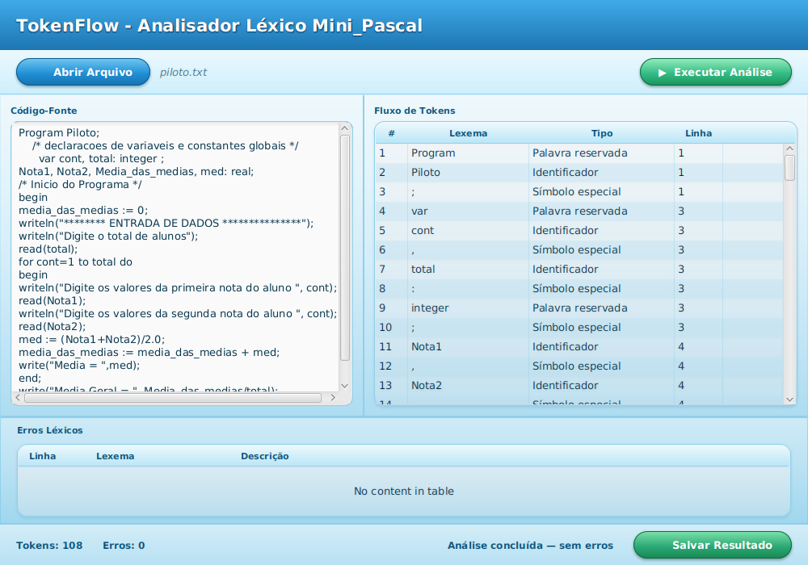

<div align="center">

# 🌀 TokenFlow

### Analisador Léxico para Mini_Pascal

*Trabalho de Compiladores - Unidade I - UESB*


</div>

---

## Sobre o projeto

O **TokenFlow** é um analisador léxico completo para o **Mini_Pascal**, uma linguagem
simplificada inspirada em Pascal. Ele lê um código-fonte (de um arquivo `.txt` ou digitado
diretamente na tela) e devolve, para cada palavra reconhecida, o par **lexema → token**,
seguindo exatamente as classes léxicas exigidas no enunciado da disciplina.

Por trás da interface, o projeto implementa um **Autômato Finito Determinístico** construído
manualmente (sem geradores de lexer prontos), com tratamento de erros que **reporta e
recupera** - um caractere inválido ou uma string mal fechada nunca travam a análise nem
derrubam o resto do arquivo.

## Como é



## Funcionalidades

- ✅ Reconhece todas as classes léxicas do enunciado: palavra reservada, identificador,
  número inteiro/real (com notação científica), operadores aritméticos/relacionais/lógicos,
  símbolo especial, atribuição, fim, constante string e char
- ✅ Tabela com as **48 palavras reservadas** do enunciado (`DOWTO` lido como `downto`) + `mod`/`and`/`or`/`not`, busca O(1),
  **case-insensitive** (`Program`, `PROGRAM` e `program` são todos reconhecidos)
- ✅ Comentários de bloco `/* */`, inclusive multilinha, com recuperação de erro se não
  fecharem
- ✅ Strings e chars mal formados geram erro léxico **sem travar o resto do arquivo**
- ✅ Limite de 63 caracteres em identificadores (truncamento, não erro)
- ✅ Interface gráfica: carregar um `.txt` **ou** digitar/colar código direto na tela
- ✅ Modo linha de comando, pra rodar em lote ou sem interface
- ✅ **124 verificações automatizadas**, incluindo baterias dedicadas a casos absurdos e de
  robustez (número colado em identificador, operadores repetidos sem espaço, comentário
  "aninhado", CRLF e CR solto, emoji, arquivo ANSI/UTF-16, locale turco...)
- ✅ 7 arquivos de teste de integração, incluindo os exemplos exatos do enunciado

## Arquitetura

O código é dividido em camadas com responsabilidade única - o núcleo léxico não sabe nada
sobre arquivos ou sobre a interface, o que permite reaproveitá-lo em qualquer um dos dois
sem duplicar lógica:

```
src/minipascal/lexico/
├── model/          → Token, TipoToken (o "vocabulário" da linguagem)
├── tabela/         → TabelaPalavrasReservadas (busca O(1) via HashMap)
├── core/           → AnalisadorLexico - o autômato em si, o coração do projeto
├── io/              → LeitorArquivoFonte, EscritorArquivoSaida (sempre UTF-8 explícito)
├── gui/             → MainApp, AnalisadorController (interface JavaFX)
├── verificacao/     → suíte de testes própria, sem depender de JUnit
└── Main.java        → ponto de entrada da versão linha de comando
```

Os recursos da interface (`Main.fxml`, `application.css`, `icon.png`) ficam na mesma pasta
da classe que os carrega, `src/minipascal/lexico/gui/`.

## Como rodar

### Pré-requisito

**JDK 8** com JavaFX embutido (ex: Oracle JDK 8u202).

### Rodar direto (sem compilar)

O `TokenFlow.jar` já vem no repositório. No Windows, dê duplo clique em `TokenFlow.bat`: ele
procura o JDK 8 em `C:\Program Files\Java` e abre o programa com ele, não importa qual
`java` esteja no `PATH`.

Pelo terminal, só funciona se o `java` do `PATH` for o JDK 8 (os Java 11+ não trazem o
JavaFX e dão `NoClassDefFoundError: javafx/application/Application`):

```bash
java -jar TokenFlow.jar
```

Se o `PATH` apontar para outro Java, chame o JDK 8 pelo caminho completo:

```powershell
& "C:\Program Files\Java\jdk1.8.0_202\bin\java.exe" -jar TokenFlow.jar
```

### Compilar e gerar o jar de novo

Um comando só, na raiz do projeto:

| Sistema | Comando |
|---|---|
| Windows (PowerShell, CMD ou duplo clique) | `.\build.bat` |
| Linux, macOS ou Git Bash | `sh build.sh` |

O script compila tudo, copia o FXML/CSS/ícone para dentro do jar e gera o `TokenFlow.jar`.
No Windows ele procura sozinho o JDK 8 em `C:\Program Files\Java\jdk1.8*`, então não
importa qual `java` está primeiro no `PATH`.

Para compilar **e** rodar todas as verificações automatizadas:

```bash
.\build.bat teste       # Windows
sh build.sh teste      # Linux, macOS, Git Bash
```

### Linha de comando (sem interface)

```bash
java -cp TokenFlow.jar minipascal.lexico.Main caminho/entrada.txt caminho/saida.txt
```
Se omitir o segundo argumento, a saída é gravada ao lado da entrada como
`<entrada>_saida.txt`.

### Rodar a partir do código-fonte, sem o script

```bash
javac -encoding UTF-8 -d out $(find src -name "*.java")
cp src/minipascal/lexico/gui/*.fxml src/minipascal/lexico/gui/*.css src/minipascal/lexico/gui/*.png out/minipascal/lexico/gui/
java -cp out minipascal.lexico.gui.MainApp
```
Em IDEs (IntelliJ, VS Code) basta abrir a pasta: `src` é a única raiz de código e os
recursos já estão nela.

## Como rodar os testes

Cada suíte é uma classe Java independente (sem JUnit), que imprime `[OK]`/`[FALHA]` linha a
linha e termina com um resumo. `.\build.bat teste` roda todas; para rodar uma só:

```bash
java -cp TokenFlow.jar minipascal.lexico.verificacao.VerificacaoFase3     # model + tabela
java -cp TokenFlow.jar minipascal.lexico.verificacao.VerificacaoFase4     # núcleo do lexer
java -cp TokenFlow.jar minipascal.lexico.verificacao.VerificacaoFase5     # comentários e erros
java -cp TokenFlow.jar minipascal.lexico.verificacao.VerificacaoFase6     # leitura/escrita de arquivo
java -cp TokenFlow.jar minipascal.lexico.verificacao.VerificacaoAbsurda   # casos extremos/maldosos
java -cp TokenFlow.jar minipascal.lexico.verificacao.VerificacaoRobustez  # Unicode, codificações, CLI
```

## Arquivos de teste

| Arquivo | O que cobre |
|---|---|
| `01_programa_simples.txt` | Exemplo básico do enunciado - saída conferida byte a byte contra o gabarito do professor |
| `02_piloto.txt` | Programa maior, com `for`, strings e comentários |
| `03_com_erro.txt` | Caractere inválido proposital |
| `04_numeros_extremos.txt` | Formatos numéricos no limite (exponentes, pontos múltiplos, número colado em texto) |
| `05_operadores_colados.txt` | Operadores grudados sem espaço, repetidos, inválidos |
| `06_comentarios_e_strings.txt` | Comentário "aninhado", string sem fechar no meio do arquivo |
| `07_casos_extremos_diversos.txt` | Identificador de 100+ caracteres, palavras reservadas em caixa mista, comentário nunca fechado |

## Decisões de projeto

Algumas leituras do enunciado exigiram uma escolha explícita onde o texto original era
ambíguo - todas documentadas e testadas:

- **Busca de palavra reservada é case-insensitive** (o próprio enunciado usa `program` e
  `Program` em exemplos diferentes)
- **`div` é Palavra reservada** (está na lista oficial); **`mod` é Operador aritmético**
  (não está na lista, mas é exigido pelo enunciado)
- **Identificador precisa começar com letra** - `_` só é permitido no meio
- **Letras são do alfabeto latino, com ou sem acento** (o enunciado usa `variável` como
  exemplo de identificador); dígitos são só `0-9`. Letras de outros alfabetos (`π`, `日本`),
  dígitos de outros alfabetos e emoji fora de string/comentário viram erro léxico (um erro
  por caractere)
- **`downto`**: o enunciado lista `DOWTO`, tratado como erro de digitação de `downto` (a
  grafia do Pascal). Só `downto` é palavra reservada; `dowto` é identificador
- **Quebra de linha**: `\n`, `\r\n` e `\r` sozinho contam uma linha cada
- **Codificação do arquivo**: UTF-8 (com ou sem BOM); se não for UTF-8 válido, lê como
  ANSI (ISO-8859-1), e UTF-16 com BOM também é reconhecido
- **Constante char aceita exatamente 1 caractere** - vazio (`''`) ou múltiplo (`'ab'`) são erro
- **String não fechada é limitada à linha atual** - evita que uma aspa esquecida engula o
  resto do arquivo inteiro
- **Limite de 63 caracteres em identificador** - o excedente é truncado, não vira erro

## Decisões pedidas no enunciado

Respostas às perguntas de projeto (a-e) da especificação:

- **a) Limite para identificadores?** Sim, 63 caracteres. O que passar disso é truncado
  (o token tem os 63 primeiros caracteres) e não vira erro.
- **b) Formato dos tokens?** Texto, sem código numérico. A palavra reservada `program` sai
  como `program<TAB>Palavra reservada`. As classes são: Palavra reservada, Identificador,
  Número inteiro, Número real, Operador aritmético, Operador relacional, Operador lógico,
  Símbolo especial, Atribuição, Fim, Constante string, Constante char e Erro léxico.
  O `=` é Operador relacional (aparece nas duas listas do enunciado; os demais símbolos
  especiais `( ) , ; :` não têm ambiguidade).
- **c) Tabela de palavras reservadas?** Opção (a) do enunciado: uma função constrói a tabela
  uma única vez, no início da execução (`TabelaPalavrasReservadas`). A estrutura é um
  `HashMap` com busca O(1), chave em minúsculas, e funções `buscar`, `contem` e `tamanho`.
- **d) Quem preenche a tabela de símbolos?** Nesta unidade não há tabela de símbolos: a tabela
  contém só palavras reservadas e `mod`/`and`/`or`/`not`. O analisador léxico apenas
  classifica os identificadores; quem inserir informações (tipo, escopo) na tabela de
  símbolos será o analisador sintático/semântico, na Unidade II.
- **e) Tratamento de erros léxicos?** Modo pânico: o erro é registrado como token
  `Erro léxico`, o analisador descarta só o trecho inválido e continua a partir do próximo
  caractere. Caractere fora da linguagem gera um erro por caractere; string e char mal
  fechados param no fim da linha; comentário sem `*/` gera um erro `/*` na linha de abertura.
  Na interface, a tabela de erros mostra a linha, o lexema e uma descrição do problema.

## Contexto acadêmico

Trabalho da disciplina de **Compiladores**, curso de Ciência da Computação - UESB.

## Autores

<table>
<tr>
<td align="center">
<a href="https://github.com/gabrielmarcone">
<br/>
<sub><b>Gabriel Marcone</b></sub>
</a>
</td>
<td align="center">
<a href="https://github.com/ccaiomatos">
<br/>
<sub><b>Caio Matos</b></sub>
</a>
</td>
</tr>
</table>

---

<div align="center">
<sub>Feito para a disciplina de Compiladores - UESB, 2026</sub>
</div>